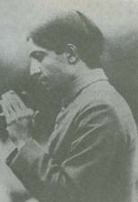
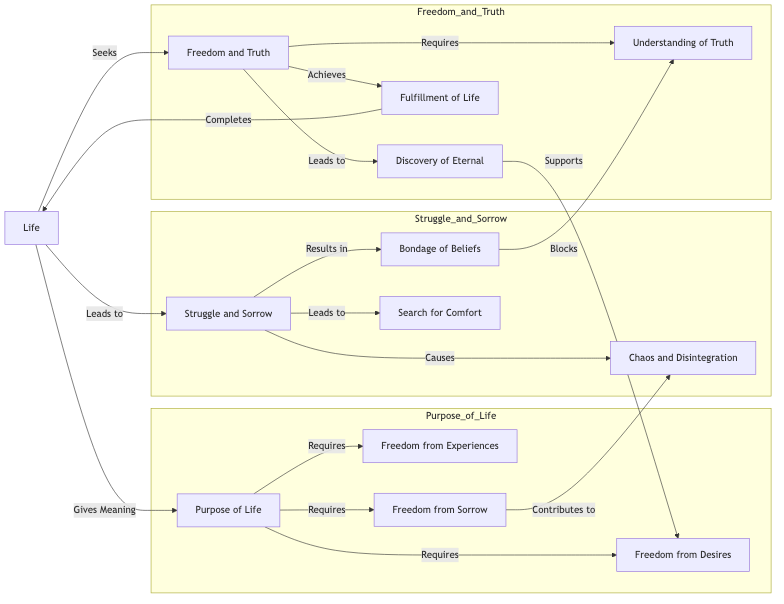

C> Life The Goal
C> 

AS A CLOUD hurried by the winds across the valley, so is man wherever he is, hurried along through life. Man has no fixed purpose, man has no understanding of the meaning of life, but is as the clouds that have no resting place, that are chased from valley to valley, that have no quietude, no tranquillity, no peace. Man has no goal, he is blind to the purpose of life and there is chaos and disintegration in him, and hence in the world.

And what is the purpose of life? It is the freedom of life, the liberation of life from all things, the liberation which comes when you have gone through all experiences and are, therefore, beyond all experience. And I want to show you that in order to fulfil life, as I have fulfilled life, you must welcome to your heart every experience, however unpleasant, however delightful, so as to make your life full as the rain-drop. You are afraid of sorrow, thinking it something fearful, something of which you are ashamed. The experience of sorrow gives you strength, strength to sustain you in your struggle, which is also experience. Invite sorrow out of the abundance of your heart, and do not put it aside, for sorrow gives the perfume of understanding, is the creator of affection, and gives you immense sympathy with life. Sorrow and pleasure, evil and righteousness have a meaning if you have established the goal; for the goal gives constantly the aid of its understanding.
 
 The attainment of Truth consists in unfolding life and in giving to life the fullest possible scope for its expression. To me the only goal, the only world which is eternal, which is absolute, is the , world of Truth. A man, who has seen this vision, even during his strife in the world, has established for himself this eternal goal. Though he may wander among the transient things, though he may lose himself among the shadows, yet all the time his life will be guided by this goal which is the freedom from all desires, from all experiences, from all sorrows, pain and struggle. For the one who desires to discover the eternal, the establishment of that goal is of primary importance; not the goal of another, not the vision of another, not the outcome of the sorrow of another, but the goal that is born of his own experience, his own understanding. Such a goal, when once he has established it, will throw light on the confusion of his thought and thereby make clear his purpose in life. I want to make this in your minds, as it is in mine, the very foundation for all thought and for all feeling. 

When once you have realized that goal, whether you are an artist, a musician, an economist, or an educationalist, you are creating then in the shelter of eternity rather than in the shadow of the present. Most people in the world are caught up in the present. The present has become as a huge shadow, and within that shadow they are creating without the understanding of the Truth. But to understand the eternal they must know that Truth is one, life is one, although that life expresses itself in many ways. But people throughout the world are seeking unity in the expression of life rather than. in life itself. Life has no temperament, life has no colour, life has no limitations, life has no barriers; these exist only for the one who tries to utilize life as the background, and not himself, as the background, the canvas, upon which life will paint the picture. 

I hold that the present chaos, anxiety and struggle, arise because life has been bound and maimed, and Truth has been limited and conditioned. Human beings throughout the world have put a limitation on Truth, they have stepped it down. (I use the term "stepped down" in its technical sense as electricity is stepped down in a power-house.) But Truth cannot be thus stepped down. People have placed a limitation on the Truth and so they have betrayed the Truth. The understanding of life has not been the predominating factor but rather the belief in innumerable doctrines, countless gods and religions. But the understanding of life is much more important, much more vital, than the bondage of innumerable creeds, religions, dogmas and theories. 

You have had your various beliefs, you have adhered to your various dogmas, you have given your life and your thought to creeds and to the bondage of religions, and in all this you have not found the lasting happiness. You have moved from one limitation to another, from one narrow cage to perhaps a larger cage, but you have not had the desire to shatter all cages, to break the bars that limit, that destroy, that inflict sorrow. Because you have placed beliefs before life, creeds before life, dogmas before life, religions before life, there is stagnation. Can you bind the waters of the sea or gather the winds in your fist? Religion, as I understand it, is the frozen thought of men out of which they have built temples and churches. The moment you attribute to external authority a spiritual and divine law and order, you are limiting, you are suffocating that very life that you wish to fulfil, to which you would give freedom. If there is limitation, there is bondage and hence suffering. The world at present is the expression of life in bondage. So, according to my point of view, beliefs, religions, dogmas and creeds, have nothing to do with life, and hence have nothing to do with Truth. 

The web of life is spun out of the common things of life, and those common things you can control. You can give them originality, you can create greatness out of them, or you can destroy them by lack of understanding. The web of life and the understanding thereof is in your own control, and not in the control of another. When you give over the control of your life to another, there is unhappiness, there is authority, which can be cut down like a tree, and the comfort of its shadow vanishes away. 

By thus limiting and betraying the Truth, fear is caused in the mind and in the heart, the fear of good and evil, the fear of narrow morality, the fear of heaven and hell. And on that background of fear you paint innumerable beliefs that place a limitation on life. Because of this fear there is a desire to seek comfort. But I say to you, seek not comfort but understanding. The search for comfort is the bondage of life and the search for understanding is the freedom of life, and you can only gain that freedom through experience. How can there be any comfort other than the understanding of Truth? You want to attain without a struggle, without a tear. A spiritual drug store is what most people are looking for, antidotes for fears - that is why you look for external help to uphold you. You are afraid to face whatever weakness is yours; afraid to face yourself and conquer. Being inexperienced of great heights, of great solitudes, of loneliness, and of eternal life, you think that you must carry with you, your friends, your qualities, your churches, your moralities, your dignities, your bonds, your rites and your religions. At these great heights you do not want such things. 

In the shadow of the present man is caught, is entangled, and thereby creates sorrow. Life for him is a continual struggle, a continual strife, a continual jostle. To dig through the present to the eternal is the purpose of man. Every human being must go through the process of digging that tunnel, the tunnel which is the direct path to the attainment of life. And that tunnel, which is the only path to the fulfilment of life, lies within yourself. And in that tunnel you cannot turn back, for you have thrown behind you that which you have dug out. You cannot but go forward, and that going forward must be reached by the discovery of Truth, or else progress, as such, ceases. To go forward with the fixed determination, in your minds, to discover the eternal beyond the shadow of the present, is the purpose of life. 

And when once you have established for yourself this goal, which is the fulfilment of life, the freedom from all desires, from all experiences, from all sorrows, pain and struggle, then that digging through the tunnel becomes an ecstasy.

 